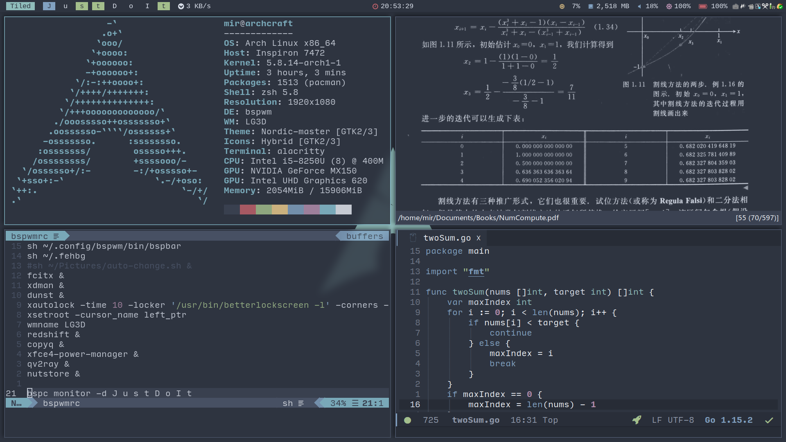
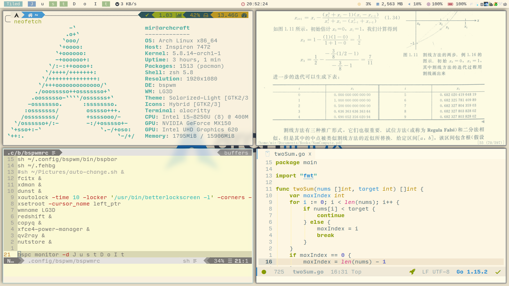

# Table of Contents

1.  [Nord and Solarized-light themes](#org95eb076)
    1.  [Dependency](#org09e8b14)
    2.  [Switch](#orgb6fe951)
    3.  [Shot](#org4ef7dbe)
    4.  [TODO](#org5bc1197)

# Nord and Solarized-light themes

## Dependency

-   Must
    -   feh
    -   dunst
    -   alacritty
    -   rofi
    -   zathura
    -   nord and solarized-light global GTK2/3 theme
        
        <https://www.gnome-look.org/p/1267246/>[Nord theme]
        
        <https://www.gnome-look.org/p/1309911/>[Solarized Light theme]
-   Optional
    -   vim
    -   doom emacs
    -   vscode
    -   sublime

## Switch

You can use the &rsquo;switch&rsquo; script to switch between the two themes.

You can view more details in itself.

## Shot

## TODO

-   [ ] Auto switch theme according to Time
-   [ ] Auto switch theme according to Backlight

