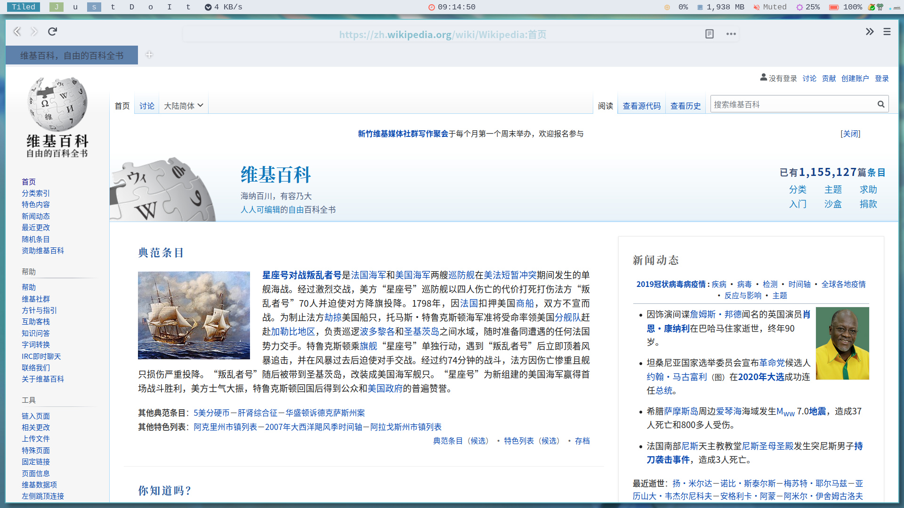

# Table of Contents

1.  [Nord and Customized-light themes](#org347d400)
    1.  [Shot](#org753cc0a)
    2.  [Dependency](#org3de952e)
        1.  [Must](#orgef234ca)
        2.  [Optional](#org9454135)
    3.  [Switch](#org174cf5e)
    4.  [About Firefox](#org33b10cc)
        1.  [Prerequisites](#orgc6bd6b6)
        2.  [Installation](#orgc971d25)
    5.  [TODO](#orgb851d31)

# Nord and Customized-light themes

## Shot

## Dependency

### Must

-   feh
-   dunst
-   alacritty
-   rofi
-   zathura
-   nord and a customized light(called AWEL-Lumine) global GTK2/3 theme

### Optional

-   firefox
    -   Dark
        
        Costomized Nord theme follow Nord palette
    -   Light
        
        Costomized light theme follow Nord/Snow palette
-   vim
    -   Dark
        
        Nord vim theme and Nord airline theme
    -   Light
        
        One vim theme and silver airline theme
-   doom emacs
    -   Dark
        
        doom-nord theme
    -   Light
        
        doom-nord-light theme
-   vscode
    -   Dark
        
        Nord theme
    -   Light
        
        Atom one light theme
-   sublime
    -   Dark
        
        Nord theme
    -   Light
        
        OneHalfLight theme

## Switch

You can use the &rsquo;switch&rsquo; script to switch between the two themes.

In my case, I put it in \`~/.local/bin/\`

You can view more details in itself.

## About Firefox

### Prerequisites

-   Verify that the user stylesheets (userChrome) option is enabled:
    1.  Go to the address \`about:config\` in Firefox
    
    2.  Search for \`toolkit.legacyUserProfileCustomizations.stylesheets\`
    
    3.  Confirm the option is set to true

-   Make sure that you have the Default theme enabled
    1.  Go to the address about:addons
    
    2.  Enable the Default theme if not already enabled

### Installation

1.  You should find you user directory. In my case, it&rsquo;s \`~/.mozilla/firefox/3ccio4xn.default-nightly/\`

2.  Backup your old config if you have.

3.  cp chrome/ dir to your firefox user directory.

## TODO

-   [ ] Auto switch theme according to Time
-   [ ] Auto switch theme according to Backlight

