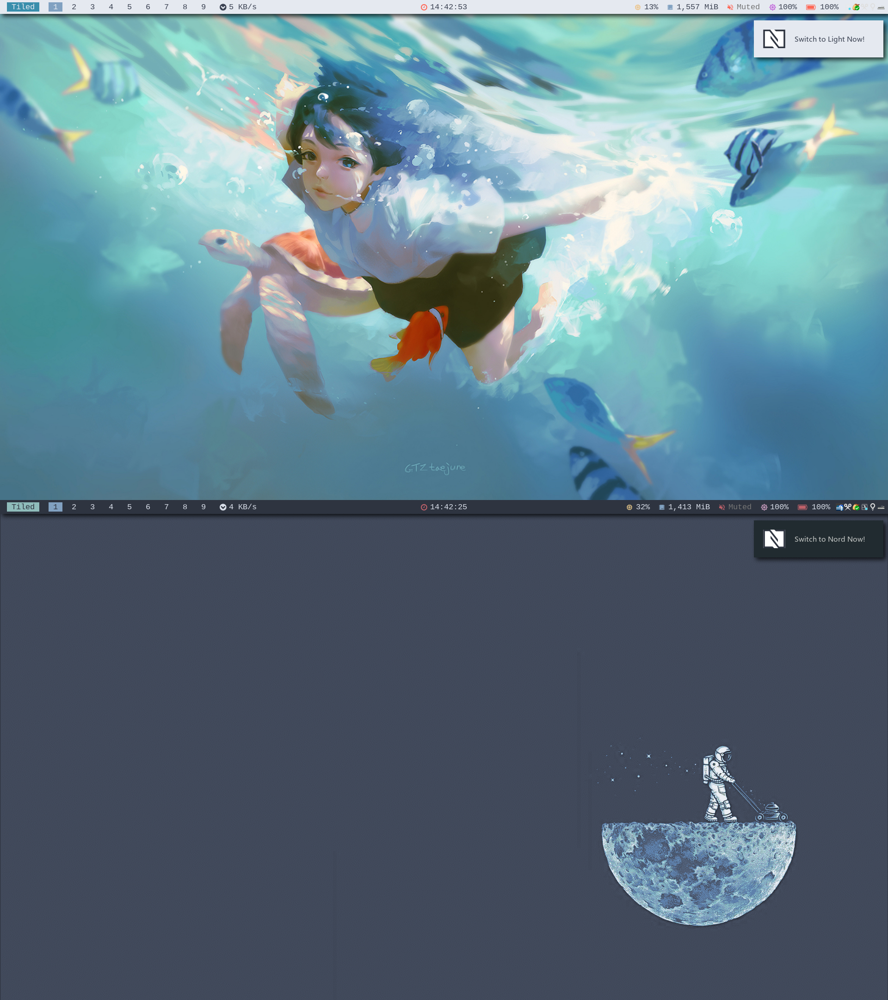
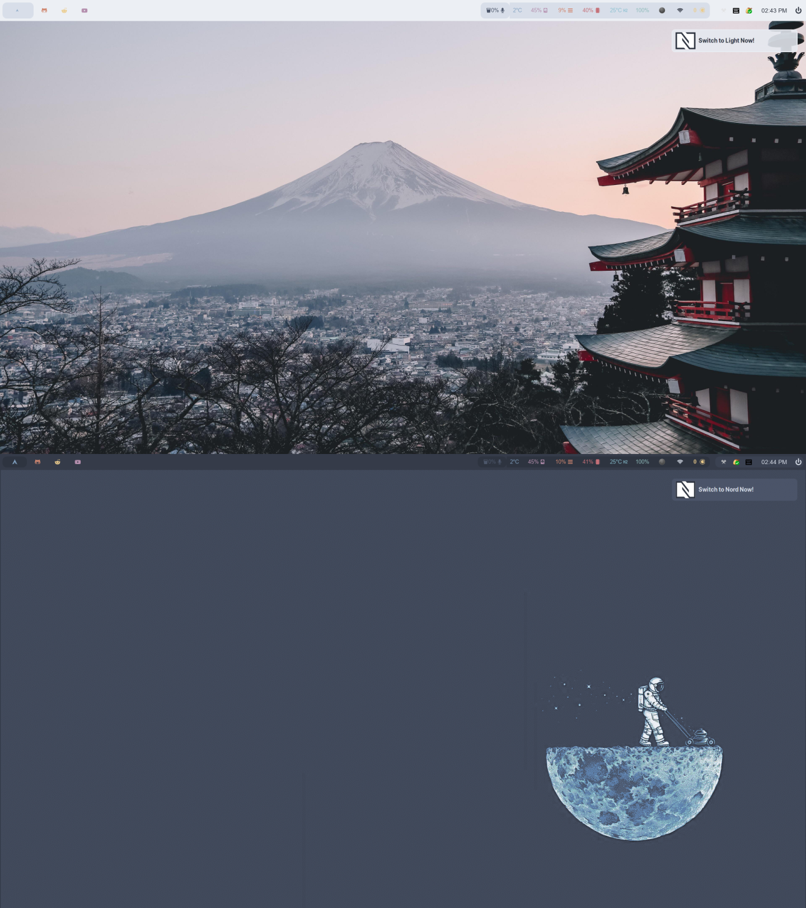
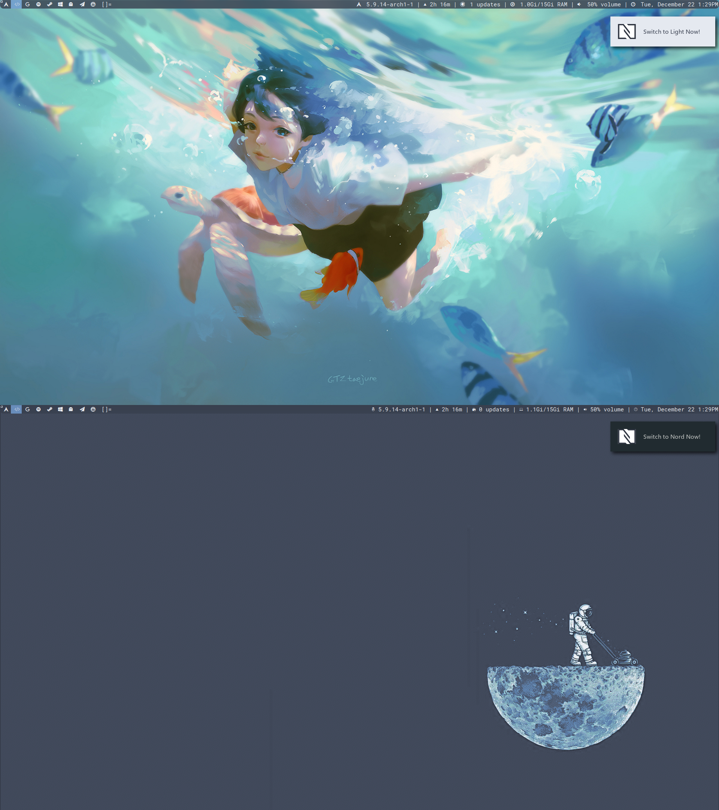
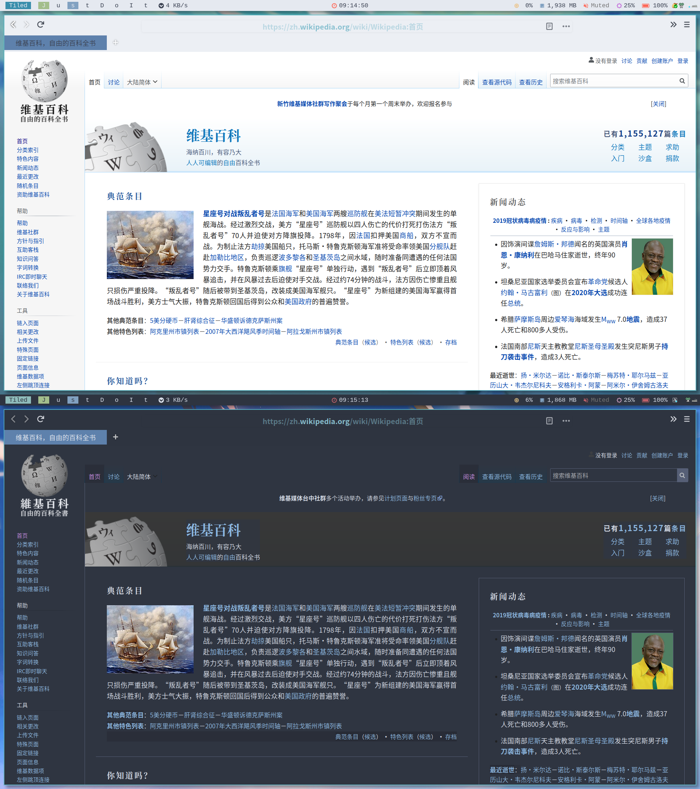

# Table of Contents

1.  [Nord and Customized-light themes](#orga92410c)
    1.  [Shot](#org6ecd7c5)
    2.  [Dependency](#org5114522)
        1.  [Must](#org8050841)
        2.  [Optional](#orge85932f)
    3.  [Switch](#org3d0cd34)
    4.  [About Firefox](#org56ea59c)
        1.  [Prerequisites](#orgb2ce2d0)
        2.  [Installation](#org5951695)
    5.  [TODO](#orgfec7e81)

# Nord and Customized-light themes

## Shot
### bspwm

### i3

### spectrwm

### xmonad

### sway

### dwm

### firefox

## Dependency

### Must

-   feh
-   dunst
-   alacritty
-   rofi
-   zathura
-   Global GTK2/3 theme
    -   [Nordic](https://www.gnome-look.org/p/1267246/)
    
    -   [Orchis-light](https://www.gnome-look.org/p/1357889/)

### Optional

-   firefox
    -   Dark
        
        Costomized Nord theme follow Nord palette
    -   Light
        
        Costomized light theme follow Nord/Snow palette
-   vim
    -   Dark
        
        Nord vim theme and Nord airline theme
    -   Light
        
        One vim theme and silver airline theme
-   doom emacs
    -   Dark
        
        doom-nord theme
    -   Light
        
        doom-nord-light theme
-   vscode
    -   Dark
        
        Nord theme
    -   Light
        
        Atom one light theme
-   sublime
    -   Dark
        
        Nord theme
    -   Light
        
        OneHalfLight theme

## Switch

You can use the &rsquo;switch&rsquo; script to switch between the two themes.

In my case, I put it in \`~/.local/bin/\`

You can view more details in itself.

## About Firefox

### Prerequisites

-   Verify that the user stylesheets (userChrome) option is enabled:
    1.  Go to the address \`about:config\` in Firefox
    
    2.  Search for \`toolkit.legacyUserProfileCustomizations.stylesheets\`
    
    3.  Confirm the option is set to true

-   Make sure that you have the Default theme enabled
    1.  Go to the address about:addons
    
    2.  Enable the Default theme if not already enabled

### Installation

1.  You should find you user directory. In my case, it&rsquo;s \`~/.mozilla/firefox/3ccio4xn.default-nightly/\`

2.  Backup your old config if you have.

3.  cp chrome/ dir to your firefox user directory.

4.  for the web page&rsquo;s nord theme
    1.  add a addon called \`Midnight Lizard\`
    
    2.  add Nord theme to it&rsquo;s color schemes
    
    3.  apply Nord theme

## TODO

-   [X] Add Dwm support
